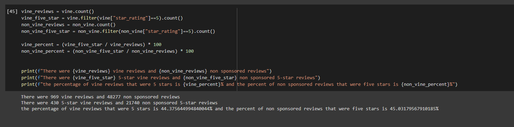

# Amazon_Vine_Analysis
## Overview

## Results
The following screenshot answers the questions, how many Vine and non-Vine reviews, how many are 5-star and what percentage of Vine and non-Vine reviews are 5-star:

## Summary
Based upon initial exploration, there does not appear to be any positivity bias in the reviews for this dataset,as both Vine and non-Vine reviews recieved around 45% 5-star reviews. However, initial analysis, could be done to sum up an average review for vine and non-vine reviews, additionally, the same analysis could be done on multiple Amazon product review datasets.
